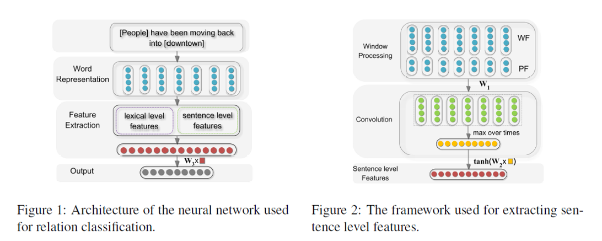

# cnn_for_re_2014

### 1.2 模型结构

### 项目环境配置

* Python3.8
* jupyter notebook
* torch           1.6.0+cu10.2
* numpy           1.18.5

### 数据集下载
SemEval2010_task8数据集，可以在https://drive.google.com/file/d/0B_jQiLugGTAkMDQ5ZjZiMTUtMzQ1Yy00YWNmLWJlZDYtOWY1ZDMwY2U4YjFk/view?sort=name&layout=list&num=50  
上下载, 解压后放在./data文件夹下

### Word embedding下载
文件名：hlbl-embeddings-scaled.EMBEDDING_SIZE=50  
链接：https://pan.baidu.com/s/1Nm1dcad7h3Y6xVQ8TK9KDw   
提取码：qn5x   
放在./embedding文件夹下

